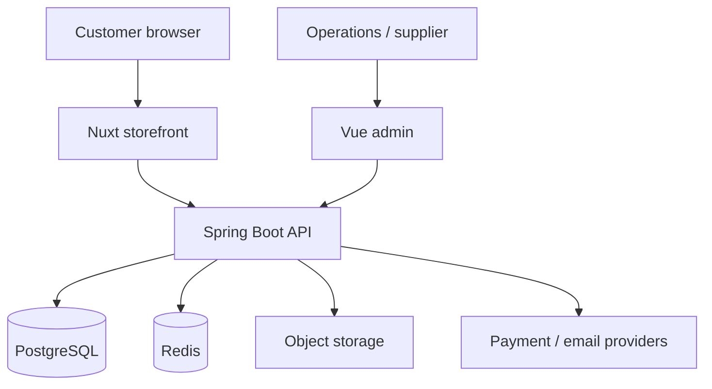

# Architecture Overview

## Decision

Shownet Travel begins as a modular monolith. Booking, inventory, payment, and refund operations require strong transactional consistency, and the current team does not benefit from distributed deployment or distributed transaction complexity.

## Deployable topology

## Backend modules

- `shared`: cross-cutting HTTP error and audit primitives only.
- `identity`: users, roles, sessions, customer and supplier identities.
- `catalog`: destinations, products, options, media, policies, and SEO content.
- `pricing`: quotes, rules, currencies, taxes, and adjustments.
- `inventory`: availability, holds, release, and oversell protection.
- `booking`: carts, orders, bookings, travelers, lifecycle, cancellation.
- `payment`: payment intents, webhook events, reconciliation, and refunds.
- `supplier`: supplier ownership, responses, contracts, and operations.
- `content`: destination pages, articles, FAQs, navigation, redirects.
- `notification`: templates, outbox, delivery status, and retries.
- `reporting`: operational read models and exports.
- `audit`: high-risk operation history and approvals.

Modules communicate through application service interfaces or domain events. A controller must never reach another module's repository.

## Data consistency

- PostgreSQL is the transactional source of truth.
- Redis may accelerate caching, rate limits, and short-lived holds but cannot be the sole booking record.
- Payment provider events have unique provider/event identifiers.
- Orders persist product, price, exchange-rate, and policy snapshots.
- Schema is changed exclusively through Flyway migrations.

